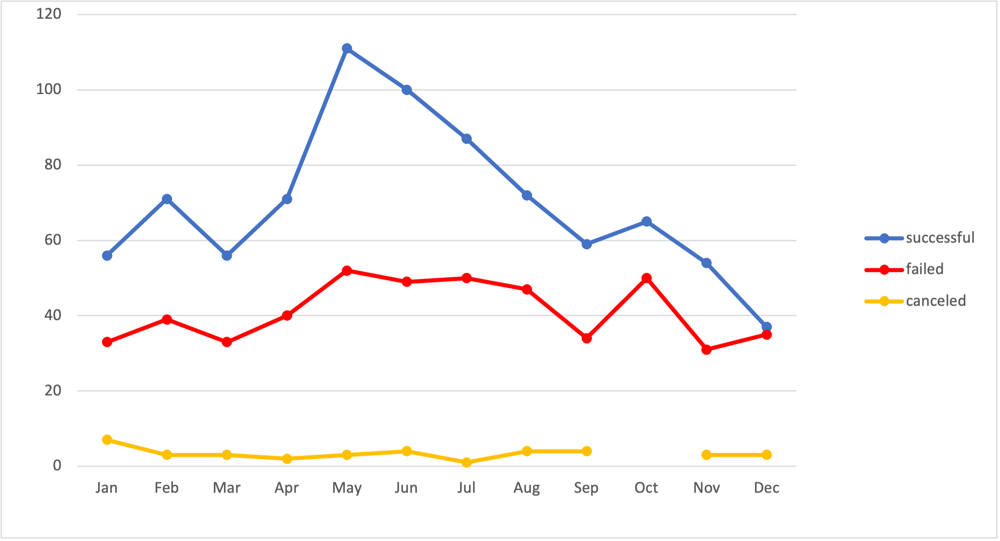
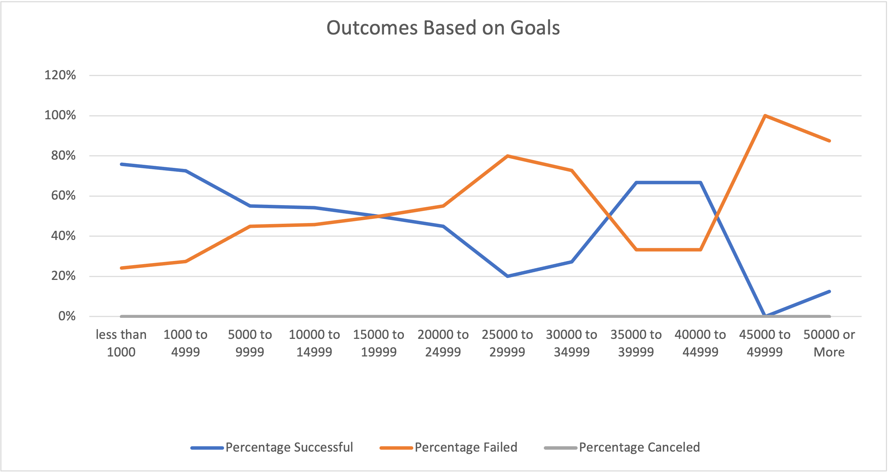

# Kickstarting with Excel

## Overview of Project

### Purpose
Louise, a fictional playwright, completed her fundraising goal. The purpose of this analysis was to help her understand the results of different campaigns in relation to their launch date and their funding goals. To do this, data was collected and manipulated within excel and visualizations were generated to help understand the results.

## Analysis and Challenges

### Analysis of Outcomes Based on Launch Date
To understand the first question, what were the campaign results based on launch date, I first created a Years column in the main data set and used a function, =Year(Serial_number), to pull the year out of the Date Created Conversion column. From there, I created a pivot chart and added filters for both Years and Parent Category. I then filtered the Parent Category by Theater since that is the category Louise is interested in. I created columns for the result of the campaign and used the Launch Date in the rows so I could group the information by months. This graph shows the relationship of the results campaigns versus the date they were created. Over the months, there were more successful campaigns than failed or canceled with an exception in December when failed and successful are almost the same. There is also a break in the line chart in October for canceled campaigns, meaning no campaigns were canceled.

### Analysis of Outcomes Based on Goals
The second analysis was to understand the outcomes of the campaigns based on their goals. To begin, I created a new sheet and structured it based on ranges of goals and specific results of the campaigns including, number, total, and percentage. I used three different functions to gather this data. To gather the results of the campaigns within a specific goal range, I used the =COUNTIF function and added criteria based on what I was searching for, the count of results of play campaigns within a goal range. To calculate the total projects, I used the =SUM function to add the counted results. The last function used was a simple division function to get the percentage result. Once this information was obtained, I created a line chart directly from this sheet highlighting specific columns including goal and percentage results. This resulted in a line graph visualizing how the ranges of goals resulted as a percentage of the total number in that range. There were no play campaigns in the data range that were canceled so the percentage canceled line is flat along the x axis. The percent successful and failed lines have an inverse relationship. There are three goal ranges where they invert. The graph shows there are multiple goal ranges that were successful.

### Challenges and Difficulties Encountered
The first analysis went pretty smoothly, the only road bump was creating a grouping on the Launch Date information so that it would display months instead of years. For this, I watched a video on how to use the Grouping option under PivotTable Analyze to then filter the information for months. 
I faced several challenges when creating the information for the Analysis based on goals. The first challenge was regarding the =COUNTIF statement. After attending a TA session, I realized I had missed one additional criteria Plays to help further filter the data. After adding that additional criteria, the resulting data was correct. The second challenge I faced was creating a line chart to visualize the data. Originally, I created a pivot table then used the information within it to create the line chart. However it would not present the ranges correctly along the X axis. I attempted to filter and resort it, but it would not change the presentation. After attending the TA session, I realized that the pivot table was unnecessary and that the line chart could be created directly from the sheet with the information. I selected the information from the sheet that I wanted displayed in the chart and simply created a line chart off of it correctly displaying the information.

## Results
Based on the visualization of Theater Outcomes by Launch Date, most campaigns were successful with May containing the most successful campaigns and the most failed. December has almost the same amount of success and failed campaigns. While October has no canceled campaign. Based on the chart I can conclude that May is the best time to launch a theater campaign and I can also conclude that December is the worst time to launch a campaign.
Based on the visualization of Outcomes based on Goals, there are multiple ranges where most other Play campaigns were successful. These ranges include goals less than $1000 to goals less $14999 and goals of $35000 to $44999. Most goals under $35000 were successful with under $1000 being most successful. In Conclusion, The most successful goals were those under $1000.
A limitation of this data set is the timeframe of the campaigns. It would be useful to see how campaigns of similar length performed for specific goal ranges in relation to when they were launched. Another limitation is what country the campaign is happening in. It would be more useful for Louise to understand how her campaign stacks up against other campaigns in the same country. Lastly the data is assumed correct but could have been entered incorrectly.
There are other tables we could create to help Louise visualize the answer to her questions. One line graph to help understand the question of Outcomes based on Launch date would be to create the line graph with an additional filter, Subcategories, so Louise could understand how specifically plays did according to when they were launched. This information could be displayed as a bar chart as well 
There are other ways to understand the question, what are the outcomes based on goals? Instead of displaying the results as a percentage, the information could be presented as a bar graph with the number of successful, failed, and canceled plays within certain goal ranges. The ranges could also be adjusted to be smaller or larger. 
